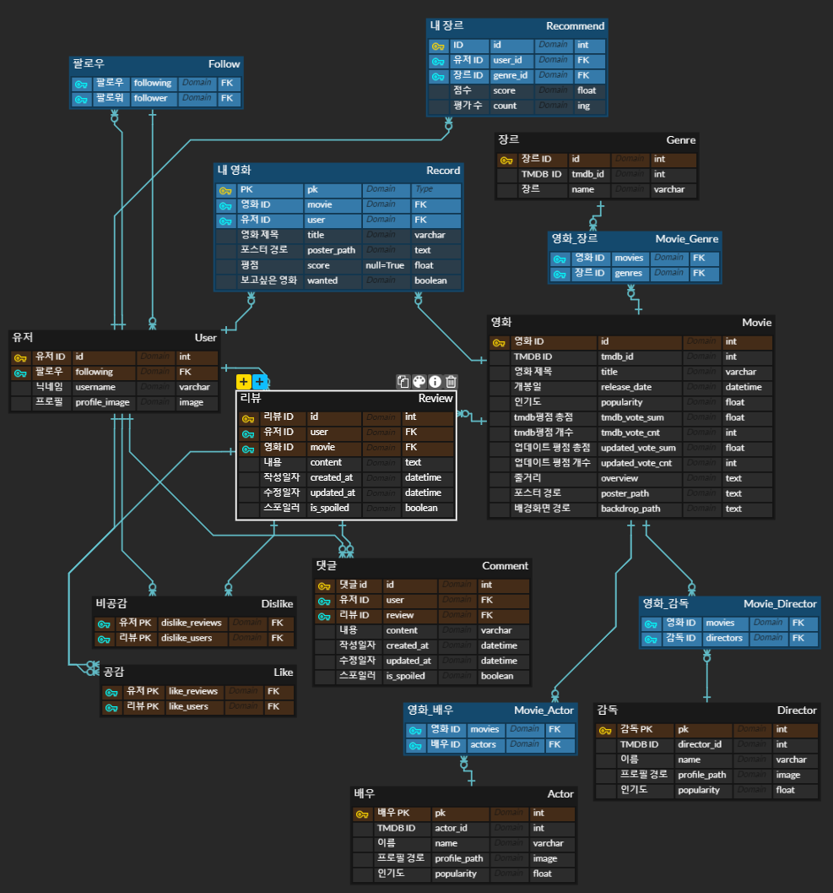
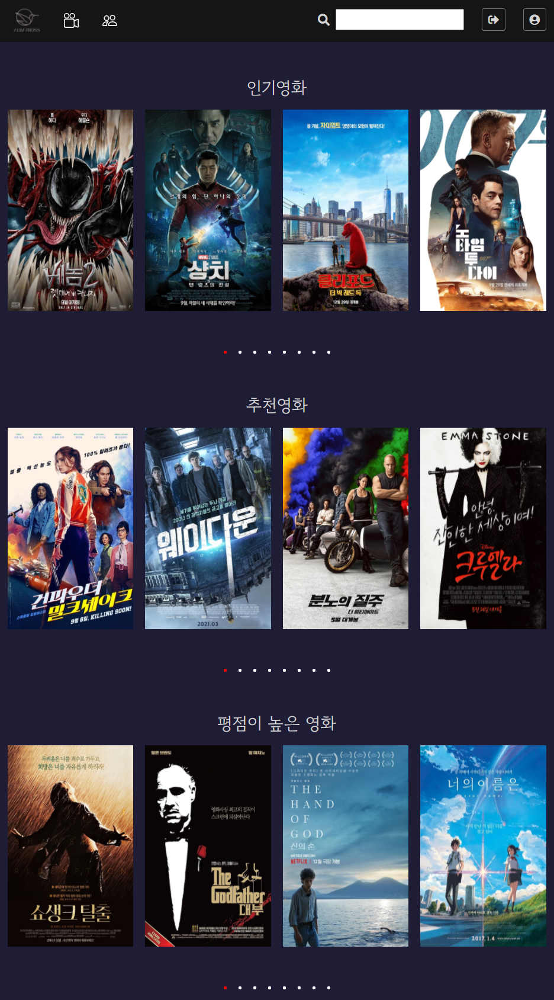
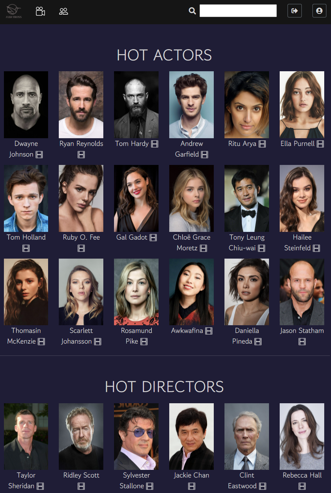
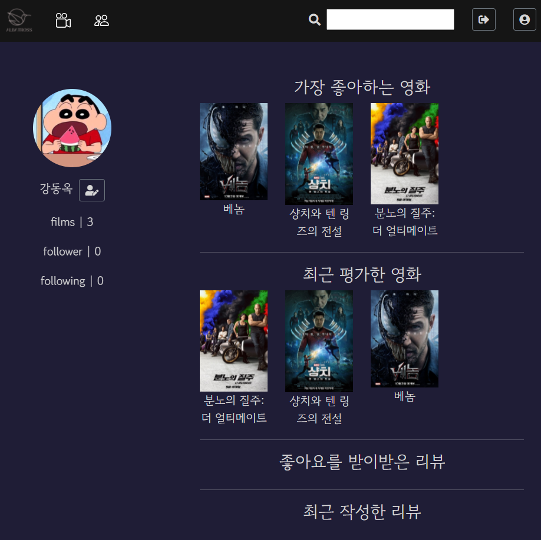

# ALBATROSS

### Project Architecture : Django REST API & Vue.js

## **Project Objective**

- 영화 정보 기반 추천 서비스 구성
- 커뮤니티 서비스 구성
    - 공통의 관심사나 환경을 가진 이들이 소통하는 웹사이트 : 접근성이 좋아야한다!
    - 비회원에게 조회 권한을 주되, 모든 기능을 제공하지 않도록 해야 이용자가 있다.
- HTML, CSS, JavaScript, Vue.js, Django, REST API, DataBase 등을 활용한 실제 서비스 설계
- 서비스 관리 및 유지보수

## **Market Research**

### **persona**

- '영화 커뮤니티'의 이용자는 아래에 해당하는 사람일 가능성이 높다.
    - A : '영화'에 관심이 많은 사람
    - B : '커뮤니티 활동'에 관심이 많은 삶
- ∴ target Audience : A ∩ B

### **expected problems**

## **Project Structure**

[used API](https://www.notion.so/used-API-a4b68b3a895f4f80a4292ff1c22dd5f1)

[Work Flow](https://www.notion.so/Work-Flow-c4b8b4654886490eb58121f43170a5c1)

1. User
    - 로그인 (+ SNS 연동(social login))
    - 영화와 M:N 관계 (평점을 기록하면 본 영화로 취급, 보고싶은 영화 check 가능)
    - 팔로우
2. Index
    - 프로젝트 이름(ALBATROSS) 애니메이션을 보여준 후 Home으로 이동
3. Home
    - 비회원
        - 전체 영화 평점순 , 인기순 , 최신순
    - 회원
        - 전체 영화 평점순 , 인기순 , 최신순 , 추천순
        - 추천 알고리즘
          
            1) 회원이 평점을 매긴 영화들의 장르별 평균 점수를 계산
            
            2) 최고점 장르의 영화들을 인기순으로 추천
            
            3) 평점을 매기지 않았으면 랜덤으로 장르를 뽑아서 추천하되, 해당하는 영화의 장르가 하나도 없다면(데이터를 조금만 불러온 경우) 다시 뽑기
        
    - 영화 / 영화인 검색
4. Movie detail
    - 포스터, 배우, 감독, 줄거리, 개봉일, 평점, 리뷰(댓글), 공감 / 비공감
5. People
    - 가장 인기 많은 배우 20
    - 가장 인기 많은 감독 20
6. Actors
    - 프로필 사진, 이름, 인기도, 출연작품
7. Directors
    - 프로필 사진, 이름, 인기도, 출연작품
8. Review
    - 리뷰
        - 상세 영화 페이지 하단에 댓글 형식
        - 리뷰 좋아요 / 싫어요
        - 상세 영화 페이지 내 리뷰 정렬 (공감순/최신순)
        - 스포일러 보이기/가리기
    - 댓글
        - 스포일러 보이기/가리기
9. Profile
    - 총 감상 영화, 팔로워, 팔로잉 개수
    - 회원 정보 수정 기능
    - 팔로우 / 언팔로우 기능
    - 유저가 가장 좋아하는 영화, 최근 평점을 매긴 영화
    - 유저의 최신 리뷰, 가장 인기가 많은 리뷰(좋아요-싫어요 순)

## **ERD**

## **Issues**

1. data Modeling 및 API data 참조작업 중 **data 무결성**이 보장되지 않는 문제 발생
    - 배우, 감독 정보를 tmdb_api를 통해 가져올 때 이름(name)으로 데이터를 참조하고자 했음
    - 동명이인의 존재 가능성을 감안하지 못하였음
    - 기존의 필드(name, profile_path, popularity)로는 효율적으로 판별하기 어렵다고 판단하여 TMDB에서 제공하는 인물의  id 데이터를 tmdb_id라는 필드명으로 추가하는 것으로 수정
    - 이 필드는 people/GET details 에 요청을 보낼 때도 사용될 수 있음
2. TMDB data의 popularity가 갖는 의미가 명확하지 않음
    - credits에 나타나는 배우의 popularity와 detail에 나타나는 popularity의 값이 다른 것을 확인
    - 추후에 실제로 데이터를 가져와본 후 더 적합한 것으로 바꿀 필요가 있음
3. release_status를 기준으로 TMDB 데이터를 가져왔으나, 실제로 개봉하지 않은 작품이 "Realeased"로 기록되어 있는 것을 확인
    - TMDB release_status 데이터의 정확성이 의심스러우므로, 해당 필드를 제거하고 날짜를 기준으로 개봉일을 계산
    - 날짜 계산은 django ORM (`__lte`)를 활용
4. 리뷰 여러 번 작성하면 마이프로필의  무비리스트 에서 데이터가 중복되는 문제가 발생하므로 리뷰를 한 번만 작성("post")할 수 있고 이후는 수정("put")하도록 변경해야함
5. Git merge 도중 package-lock.json 파일의 충돌로 인해 프로젝트 전체에서 오류가 발생
    - 충돌된 라이브러리를 확인할 수 없어 새롭게 프로젝트를 생성하고, 사용하는 라이브러리만을 재설치하여 복구

## pages

---

## 후기

- 양지훈
    - 처음 프로젝트를 시작할 때, 코딩 경험이 적고 프로젝트를 진행해 본 경험이 없어 하루에 얼마나 작업을 진행할 수 있을지 계획을 세우기 어려워 막막했습니다.
    - 생각대로 코드를 작성하는 부분이 어렵지는 않았지만, 오류가 한 번 발생했을 때 딜레이되는 시간이 너무 길었던 것이 목표치에 달성하지 못한 가장 큰 이유인 것 같습니다.
    - 수업 때 했던 workshop 자료들이 단편적인 기능들을 되짚어보는데 큰 도움이 되었습니다.
    - 프로젝트를 시작하기 전에 모델링을 잘 해둬야 `ctrl+z`를 줄일 수 있다고 많이 강조하셔서 그렇게 하도록 노력했음에도, '모델을 고쳐야할까...'라는 생각을 하게되었습니다...
    - 단기간에 과한 목표를 설정했고, 모두 달성하지 못했습니다. 하지만 그 과정에서 급격하게 많이 배울 수 있었던 것 같습니다.
    - 목표설정의 중요성에 대해 많이 느낄 수 있었습니다. 할 수 있는 것과 할 수 없는 것을 구분하여 프로젝트를 진행했다면 기능들의 완성도가 더 높았을 것 같습니다. 또한, 과한 목표로 인해 체력적으로 지치게 되면서 프로젝트 마지막에 집중력이 떨어졌습니다. 특히, 프로젝트 막바지에 데이터끼리 상호작용이 많아짐과 동시에 오류가 많이 생겨 더욱 어려움을 느꼈던 것 같습니다.
    - 그럼에도, 모든 기능은 아니더라도 필수기능 + 절반의 추가기능까지 만들어낼 수 있었던 이유는 팀원의 협업 덕분이었다고 생각합니다. 알고리즘 스터디를 할 때도 느끼지만, 혼자서 코드를 읽을 때는 전혀 보이지 않던 간단한 오류를 찾는 시간이 매우 빨라졌습니다.
    - 협업 과정에서 Git merge를 사용하여 형상관리를 하는 것이 왜 편리한지 절실히 느낄 수 있었습니다. pull/push가 사용하기 쉽다고는 하나, git merge를 적극적으로 활용해보니 훨씬 더 편하다고 느껴졌습니다.

- 정성우
    - SSAFY에서 학습한 개념과 기술 스택들(django & vue.js)은 대부분 이해하고 있다고 생각했지만 이번 프로젝트를 통해 그것이 큰 오산이었음을 알았습니다.
    - 개별적인 기술들의 사용법은 충분히 숙지하고 있었지만 그것이 복합적으로 얽히게 되었을 때 발생하는 예외 처리에 효과적으로 대처하지 못했습니다.
    - ERD와 프로젝트 구성 설계에 많은 시간을 투자했음에도 착오 및 데이터 오류로 인해 변경사항이 발생했습니다. 설계는 철저히 해야하지만 모든 에러를 방지할 수는 없습니다.
    - 매일같이 밤을 새며 프로젝트를 Develope했지만 아직 해결되지 못한 오류들이 많아서 아쉽습니다.
    - 노션은 초기에는 활발히 작성했지만 후반에는 프로젝트에 집중하느라 기록에 소홀해졌습니다.
    - 이번 프로젝트를 통해 Git Merge를 통한 형상관리와 충돌 해결을 경험할 수 있어서 좋았습니다.
    - 의사소통이 원활한 페어와 프로젝트를 진행해서 힘들지만 행복한 시간이었습니다. 페어로부터 많은 배려를 받았고 제가 원하는 방향으로 프로젝트를 진행할 수 있어서 감사한 시간이기도 했습니다. 소프트웨어 개발에서 의사소통의 중요성을 체감할 수 있었습니다.